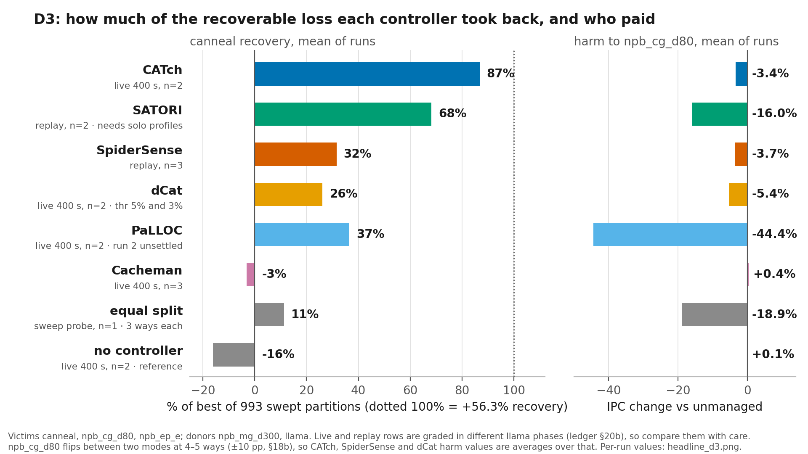
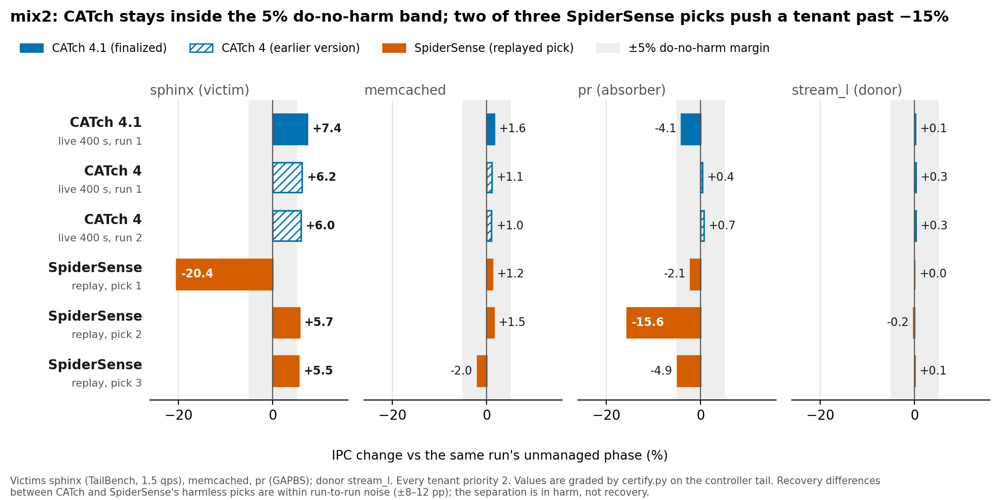
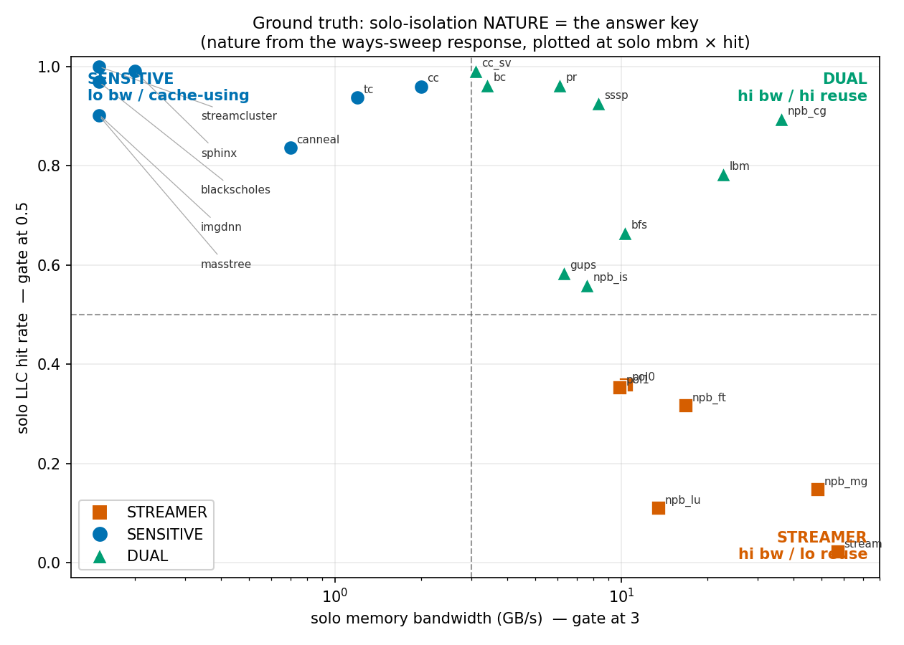
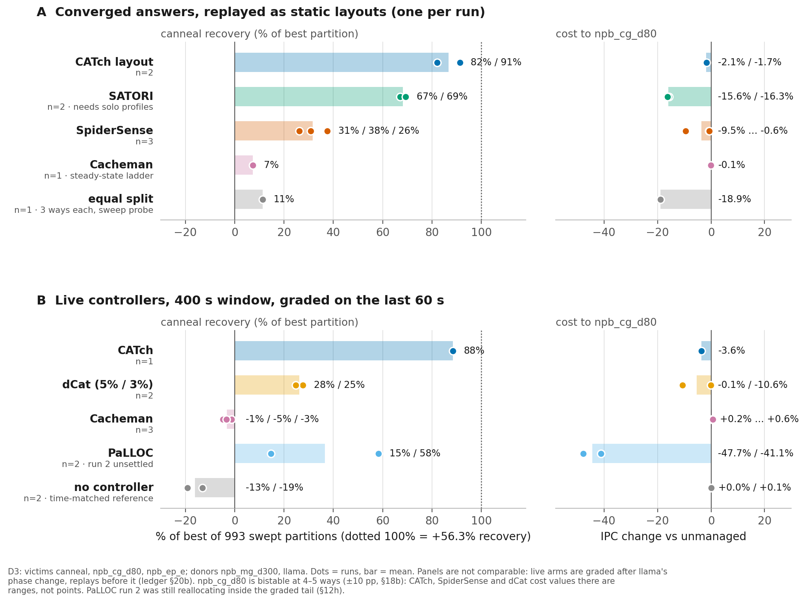
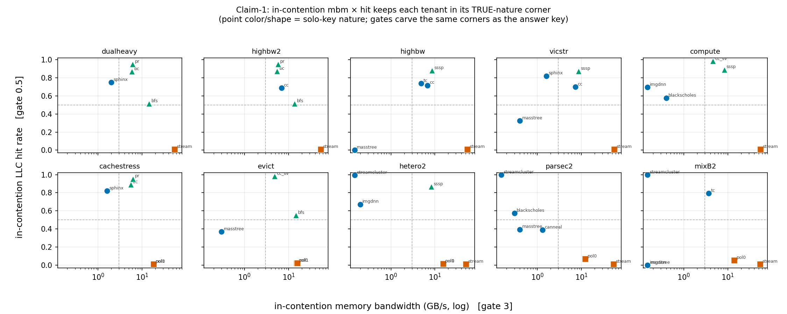

# CATch: safe cache repair for opaque co-located tenants

**Perturb, don't infer.** CATch is a userspace controller that recovers the
performance co-located tenants lose to LLC interference. It needs no solo
profiling, no offline search, no declared SLOs, and no application changes,
and it holds every tenant, including the one it takes cache from, to its
own unmanaged performance.

- **Recovers the most.** On scene D3, CATch recovers **87%** of the best
  result found by sweeping all 993 cache partitions, the highest of every
  controller we measured (SATORI 68%, PaLLOC 37%, SpiderSense 32%, dCat 26%;
  CATch figures are the `coeffd4` runs).
- **Harms the least while doing it.** It is the only controller with top-tier
  recovery that keeps the co-tenant inside the 5% do-no-harm margin. On mix2
  it stayed inside that margin in every run, while two of SpiderSense's three
  converged picks pushed a tenant more than 15% below unmanaged.
- **Takes cache almost for free.** Fencing a streaming aggressor costs it
  **~1%** of its own IPC; the MBA throttle that controllers usually reach for
  costs the same tenant **~93%** (replicated, n=2).
- **Works on black boxes.** Tenant nature (streamer / sensitive / dual) comes
  from two hardware counters and matches the isolated-run ground truth.



## The idea

Hardware counters tell a controller what a tenant *is*, but not what it
*needs*. The tenants that grab freed cache are often not the ones that can use
it, and a tenant's own hit rate or occupancy can look healthy while it slows
down. So CATch does not try to predict who needs cache. It **acts, and
measures**:

1. **Classify by nature.** A tenant that moves a lot of memory bandwidth
   (MBM) at a very low LLC hit rate is a *streamer*: it fills the cache with
   lines it never reads again.
2. **Fence the streamers.** Each streamer is confined to an exclusive band,
   seeded at its current occupancy and narrowed one way at a time. Because a
   streamer has no reuse, this costs it almost nothing, which makes the fence
   a probe CATch can afford to run.
3. **Let the crowd expand, and watch who converts.** The freed ways go to the
   remaining tenants by ordinary LRU. CATch measures MB gained against IPC
   gained for each of them.
4. **Cap the absorbers.** A tenant that took the cache without turning it into
   IPC gets its own band, seeded at occupancy and walked down until its
   associativity knee.
5. **Verify every step.** Each change is checked against every tenant's
   unmanaged IPC, donors included, and rolled back if anyone falls below it.
   Throttling and cross-socket migration remain as fallbacks.

Full design and the measurements behind each rule:
[`streaming_coeff/coeffd/COEFFD4_DESIGN.md`](streaming_coeff/coeffd/COEFFD4_DESIGN.md).

## Results

### Scene mix2: nobody pays

Every tenant's IPC change in every run. The shaded band is the 5% do-no-harm
margin:



### Nature from two counters

Memory bandwidth × LLC hit rate separates streamers from cache-sensitive
tenants, checked against isolated runs:



<details><summary>More: per-run D3 figure and per-mix classification</summary>




</details>

### Findings the design is built on

- **Capacity and associativity are the same knob under CAT.** Capping a
  high-reuse tenant at its own occupancy still cost it 7–9% (n=2), because an
  N-way mask is N-way associative. This is why CATch walks every cap down one
  way at a time instead of computing it, and on D3 the walk stopped exactly at
  the knee.
- **Freed cache goes to the most aggressive reuser, not the neediest.** On D3,
  the absorber took more of the freed cache and converted it 57× worse than
  the victim. That is what the absorber cap is for; on mix2, CATch 4.1 capped
  the absorber (pr) at 5 ways while keeping it inside the margin (−4.1%).

### Data in this repository

| Directory (`exp16_natural_contention/results_certify/`) | What it is |
|---|---|
| `D3_order`, `D3_c4_400b` | CATch (`coeffd4`) live on D3 |
| `D3_c41_400*` | CATch (`coeffd4.1`) live on D3 |
| `D3_spider`, `D3_spconv*`, `D3_rep_spider_conv` | SpiderSense sweep and its converged picks replayed live |
| `D3_rep_sat_conv*` | SATORI's converged masks replayed live |
| `D3_rep_cm_nest`, `D3_rep_band_dp*` | Cacheman overlap-vs-depth test |
| `D3_dcat*`, `D3_palloc*`, `D3_cacheman*` | dCat, PaLLOC, Cacheman live |
| `D3_null*` | no controller (reference) |
| `mix2n_*` | mix2: teeth run, SpiderSense sweeps and replays, CATch runs |

Each run holds `cfg.json` and, per phase, `decisions.jsonl` (every scan,
apply, commit and rollback) and `perf_<tenant>.json` (IPC). Grade any run
with `certify.py`. Run-to-run noise on recovery is ±8–12 percentage points,
so compare controllers by ordering; D3 rows mix live and replayed arms (see
the figure note).

## Repository map

```
streaming_coeff/
  coeffd/
    coeffd4.1.py            CATch, the finalized controller
    coeffd4.py              previous version (D3 headline runs)
    coeffd3.py              base daemon: sampling, RDT, MBA, migration
    COEFFD4_DESIGN.md       design document
    test_coeffd4*.py        offline unit tests (no hardware, no root)
  exp16_natural_contention/
    run_certify.sh          launches a scene and runs one or more controller arms
    bench_lib.sh            workload launchers, binary paths, turbo-off gate
    run_iso.sh              isolated per-tenant baselines
    run_mix2_oracle.sh      mix2 pipeline (iso -> teeth -> SpiderSense sweep -> grade)
    certify.py              grader: victim recovery + per-donor cost, every tenant
    *_style.py              peer controllers re-implemented from their papers
                            (SpiderSense, SATORI, dCat, Cacheman), with tests
    results_iso/            isolated baselines for D3 and mix2
    results_certify/        the runs shown in the figures
  figures/                  result figures
```

## Requirements

- An Intel server with **RDT**: CAT (L3 masks), MBA and MBM/CMT, with
  `resctrl` mounted at `/sys/fs/resctrl`. Developed on 2× Xeon Gold 6430:
  60 MB L3 per socket, 15 CAT ways (4 MB each), MBA in 10% steps. `WAY_MB`
  in `coeffd4.1.py` sets the MB per way.
- Linux `perf` and root (`sudo`). **Turbo must be off**
  (`/sys/devices/system/cpu/intel_pstate/no_turbo = 1`); the harness enforces
  it. Scenes run on socket 0; socket 1 is the migration destination.
- Python 3 (standard library). The SATORI arm also needs `scikit-optimize`
  and `scipy`.

### Workloads (build from source)

Paths are set in `bench_lib.sh`.

| Tenant | Source | Expected path |
|---|---|---|
| `npb_*` (cg, mg, ep, ...) | NAS Parallel Benchmarks 3.4.2 (OMP) | `exp16_natural_contention/npb_bin/*.x` |
| `canneal` | PARSEC 3.0 | `$PARSEC/kernels/canneal/...` + `parsec_inputs_can/` |
| `llama` | llama.cpp + qwen2.5-0.5b-instruct Q4_K_M | `bench_extra/llama.cpp/...` |
| `sphinx` | TailBench | `$TAILBENCH_DIR/sphinx/` |
| `memcached` | memcached + memtier_benchmark | `bench_extra/...` |
| `pr` | GAP benchmark suite | `exp8_inbetween_victim/pr` |
| `stream_l` | STREAM (looped) | `exp16_natural_contention/bench_bin/stream_long` |

PaLLOC (`PALLOC_DIR`) and the SATORI artifact (`SATORI_PYDEPS`) are used from
their authors' public repositories.

## Running

Unit tests (no root needed):

```
cd streaming_coeff/coeffd && python3 test_coeffd4.py && python3 test_coeffd4_1.py
```

**Scene D3.** Victims canneal, npb_cg_d80, npb_ep_e; streamers npb_mg_d300
and llama. CATch runs for a 400 s window:

```
cd streaming_coeff/exp16_natural_contention
sudo env COEFFD4=$PWD/../coeffd/coeffd4.1.py POL="npb_mg_d300 llama" POLNC=4 \
     ISO_AS=D3 AS=D3_c41_400 RUNDSOLO=1 ARMS= CTRLS=c4 C4WIN=400 \
     ./run_certify.sh canneal npb_cg_d80 npb_ep_e
python3 certify.py results_certify/D3_c41_400
```

**Scene mix2.** Victims sphinx, memcached, pr; streamer stream_l:

```
sudo env COEFFD4=$PWD/../coeffd/coeffd4.1.py POL="stream_l" POLNC=4 \
     ISO_AS=mix2n AS=mix2n_c41r1 RUNDSOLO=1 ARMS= CTRLS=c4 C4WIN=400 \
     ./run_certify.sh sphinx memcached pr
```

Other arms are selected with `CTRLS=` (`spider_conv`, `dcat`, `palloc`,
`cacheman`, `null`, ...). Environment variables go **after** `sudo`, which
resets the environment. `COEFFD4` defaults to `coeffd4.py`.

## Scope

CATch targets interference that shows up in hardware counters. Tenants whose
harm is visible only in latency rely on the optional SLO feed.
CATch reclaims and redistributes cache; it does not assign freed capacity to a
named tenant, and bandwidth-bound victims are left to the throttle and
migration fallbacks.
